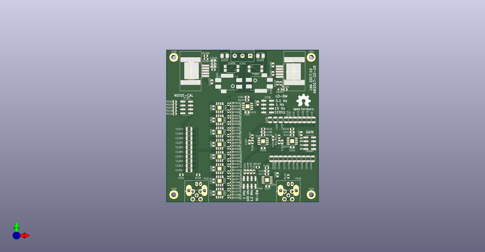
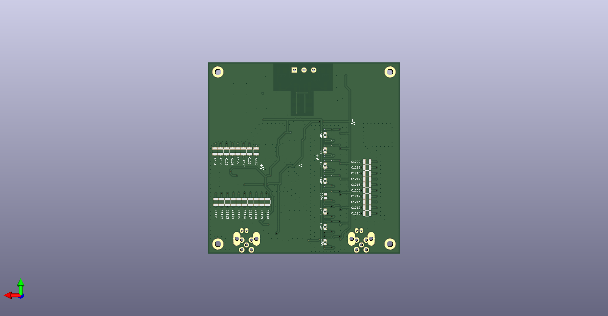

# ADA4898_LNA
Low Noise Amplifier based on [ADA4898](https://www.analog.com/en/products/ada4898-1.html).
Inspired by Gerhard Hoffmann's "lono" design  http://www.hoffmann-hochfrequenz.de/downloads/lono.pdf

## References

- [LT AN83: "Performance Verification of Low Noise, Low Dropout Regulators"](https://www.analog.com/media/en/technical-documentation/application-notes/an83f.pdf)
- [AN159 "Measuring 2nV/√Hz Noise and 120dB Supply Rejection on Linear Regulators"](https://www.analog.com/en/app-notes/an-159.html)
- Leach ["Fundamentals of Low-Noise Analog Circuit Design "](https://leachlegacy.ece.gatech.edu/papers/AnalogNoise.pdf)
- Wenzel ["A Low Noise Amplifier for Phase Noise Measurements"](http://www.wenzel.com/wp-content/uploads/lowamp.pdf)
- Rubiola and Lardet-Vieudrin ["Low Flicker-Noise DC Amplifier for 50 Ω Sources"](http://rubiola.org/pdf-articles/conference/2004-fcs-dc-amplifier.pdf)
- TI ["Source resistance and noise considerations in amplifiers"](https://www.ti.com/lit/an/slyt470/slyt470.pdf)

## PCB
100mm x 100mm two-layer PCB.

